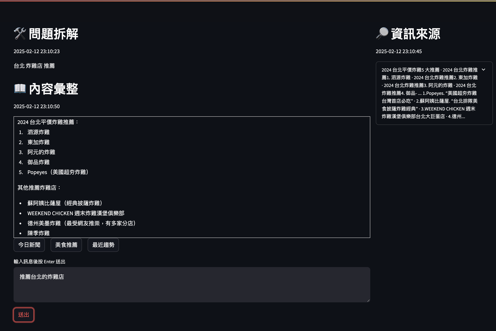
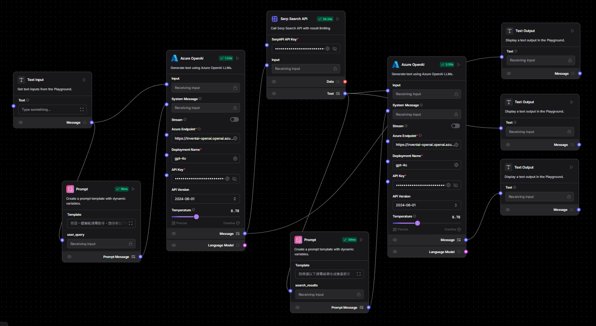

# **Streamlit Text Analysis Using LangFlow**

## **📌 專案簡介**
這是一個使用 **Streamlit** 開發的 **對話分析應用**，並使用 **LangFlow API** 進行 **對話分析**。應用已經 **Docker 容器化**，可以快速部署。

## **⚡ 功能特色**
✅ 使用 **Streamlit** 建立互動式對話介面  
✅ 透過 **LangFlow API** 進行對話分析  
✅ **Docker 容器化**，可跨平台部署  
✅ **Docker Compose** 支援，方便管理  


## 系統介面與分析結果(介接LangFlow對話摘要)


## LangFlow流程設計範例


---
## **📂 專案目錄結構**
```
textanalysis/
│── app.py                 # Streamlit 應用主程式
│── requirements.txt       # Python 依賴套件
│── Dockerfile             # Docker 映像檔配置
│── docker-compose.yml     # Docker Compose 配置（可選）
│── README.md              # 專案說明文件
└── images                 # 系統範例截圖
```

---
## **🚀 快速開始**

### **1️⃣ 安裝相依套件（非 Docker 方式）**
如果你想在本機運行，請確保已安裝 Python 3，並執行：
```bash
pip install -r requirements.txt
```

啟動 Streamlit 應用：
```bash
streamlit run app.py
```
應用將運行在 **http://localhost:8501**。

---
### **2️⃣ 使用 Docker 部署**

#### **🔹 方法 1：直接使用 Docker**
1. **建置 Docker 映像**：
   ```bash
   docker build -t streamlit-textanalysis .
   ```

2. **運行 Docker 容器**：
   ```bash
   docker run -it --rm -p 8501:8501 streamlit-textanalysis
   ```

應用將在 **http://localhost:8501** 運行。

#### **🔹 方法 2：使用 Docker Compose（推薦）**
0. **建置映像檔**：
   ```bash
   docker-compose build

1. **啟動容器**：
   ```bash
   docker-compose up -d
   ```
2. **停止容器**：
   ```bash
   docker-compose down
   ```

---
## **⚙️ 技術棧**
- **Streamlit** - 建立 Web 應用
- **LangFlow** - 對話分析推論
- **Docker** - 容器化應用

---
## **📜 版權 & 授權**
本專案以 **MIT License** 授權，你可以自由修改、分發，但請註明來源。

🚀 **歡迎貢獻！有任何問題，請提交 Issue 或 PR！**

